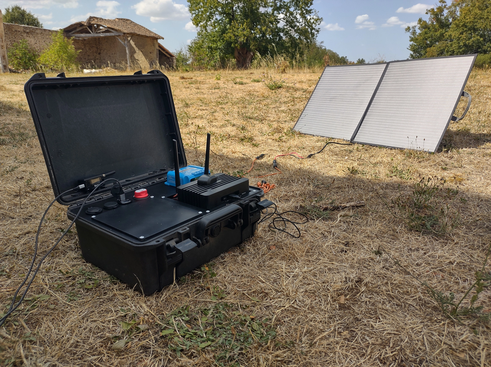
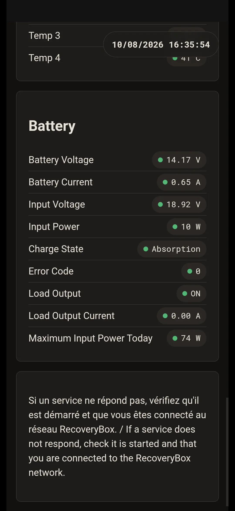
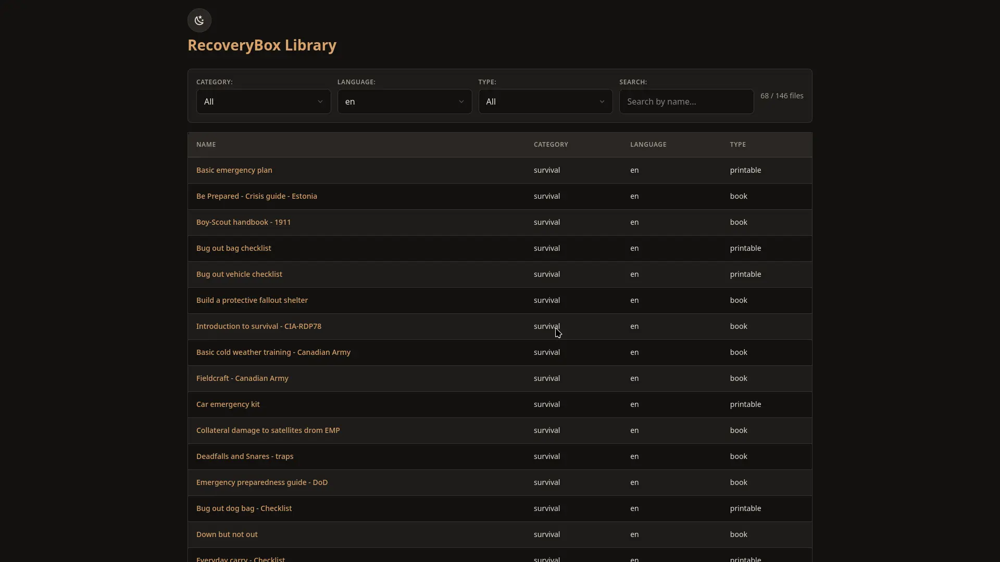
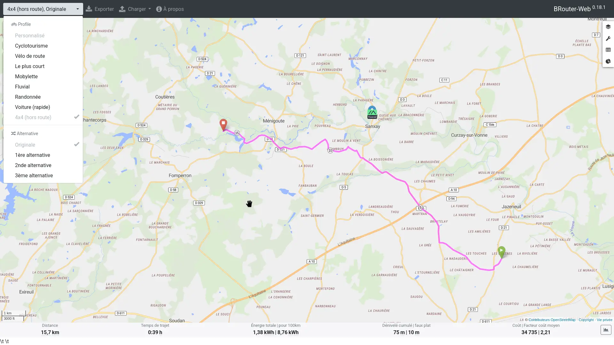
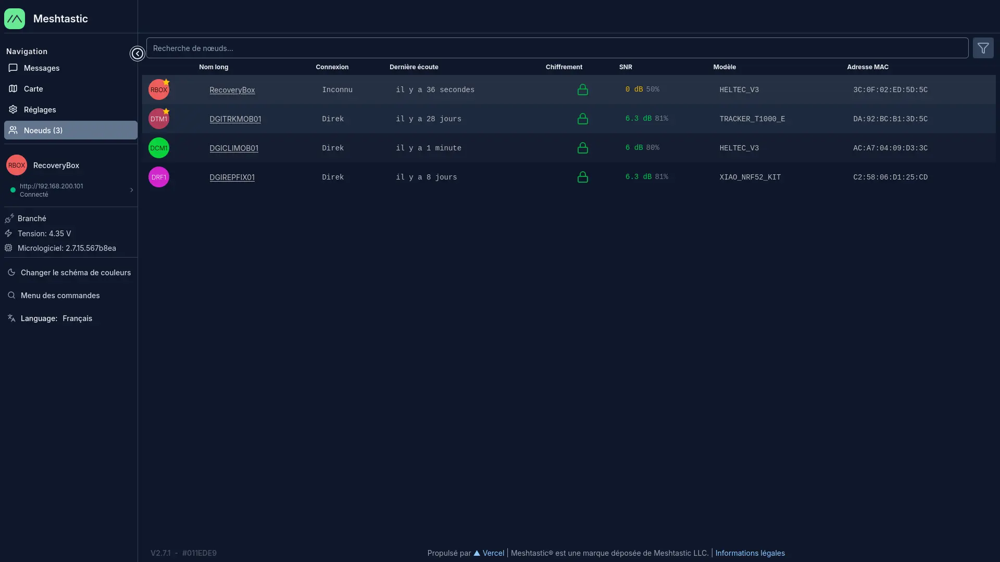
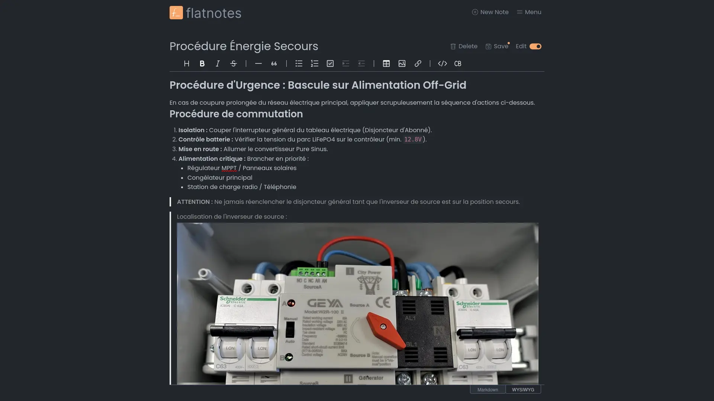

<section class="rb-hero" markdown>

# RecoveryBox {: .md-typeset .md-display-1 }

## La solution numérique en cas de rupture de la normalité. 

[Wiki Technique](https://recoverybox.fr/wiki/){ .md-button .md-button--primary }
[Actualités](blog/index.md){ .md-button }
[Galerie](#section-galerie){ .md-button }
[Contact](#section-contact){ .md-button }

</section>

- [:material-battery-high: **Une solution autonome**](#section-autonome)

    Pensé pour fonctionner dans toutes les conditions, même sans connexion Internet.

- [:material-debian: **Open Source**](#section-debian)

    Conçu sur une base open source, garantissant transparence et flexibilité.

- [:material-wifi: **Point d'Accès WiFi**](#section-wifi)

    Crée un réseau WiFi local pour connecter tous vos appareils et accéder aux services.

- [:material-radio: **Radio SDR (OpenWebRX Plus)**](#section-radio)

    Interface web pour recevoir et écouter les fréquences radio via des clés USB RTL-SDR.

- [:material-lan: **Réseau Mesh (Meshtastic)**](#section-mesh)

    Client web pour visualiser les nœuds Meshtastic et cartographier le réseau local.

- [:material-map: **Cartographie Offline**](#section-carto)

    BRouter, tileserver-gl et cartes locales pour calculer des itinéraires sans Internet.

- [:material-wikipedia: **Documentation Hors Ligne**](#section-documentation)

    Accédez à Wikipédia en français et en anglais via des fichiers ZIM, sans connexion Internet.

- [:material-crosshairs-gps: **Synchro GPS & Temps**](#section-gps)

    Chrony fournit l'heure exacte au serveur via un module GPS connecté.

- [:material-server: **Architecture client-serveur**](#section-architecture)

    La RecoveryBox repose sur une architecture client-serveur, les services sont accessibles simultanément depuis n'importe quel appareil connecté au Wi-Fi local.

---

- {.on-glb}
- {.on-glb}
- {.on-glb}
- {.on-glb}
- {.on-glb}
- {.on-glb}

## Une solution autonome {: #section-autonome .rb-section-title }

La RecoveryBox a été pensée comme une solution complète et autonome, capable de fonctionner dans des environnements isolés ou en cas de crise. Déployable en quelques secondes, elle offre un accès immédiat à des services numériques essentiels sans dépendre d'une connexion Internet. Si la partie logicielle peut s'utiliser seule, c'est combinée à son matériel dédié qu'elle exprime toute son autonomie.

Panneau solaire, régulateur MPPT Victron et batterie LiFePO4 de 20Ah : chaque composant garantit une indépendance électrique totale. Développée autour de mini-PC à très faible consommation, la RecoveryBox offre 24h d'énergie en continu sans soleil. Couplée à son panneau de 100W, elle fonctionne indéfiniment de manière autonome, assurant la continuité de la cartographie, des communications et des ressources d'urgence.

Cette autonomie se traduit aussi par une connectivité flexible (point d'accès Wi-Fi local, partage de connexion smartphone ou liaison filaire) et une conception résiliente. Intégrée dans une valise renforcée, étanche et antichoc, elle se transporte facilement sur le terrain. Côté logiciel, son architecture modulaire isole chaque service en conteneur, garantissant un système personnalisable, robuste et à l'épreuve des pannes.

## Open Source {: #section-debian .rb-section-title }

La RecoveryBox repose sur Debian GNU/Linux et des briques 100 % open source, garantissant une transparence totale, une sécurité accrue et une souveraineté numérique absolue.

Un écosystème éprouvé et ouvert :

- **Infrastructures & Conteneurs** : S'appuie sur des standards de l'industrie comme Docker pour l'isolation des services, Apache pour le traitement web, et des outils réseau robustes.

- **Services embarqués d'exception** : Intègre directement des projets libres de référence tels que [Kiwix](https://www.kiwix.org/) (documentation hors-ligne), [OpenWebRX+](https://openwebrx.de/) (radio SDR) ou [BRouter](https://brouter.de/) (cartographie).

- **Code public sur GitHub** : L'intégralité du code source et des scripts de déploiement est librement accessible sur [GitHub](https://github.com/mr-dgidgi/recoverybox), permettant à quiconque d'auditer le système, de le dupliquer ou de l'adapter sur-mesure.

Libre de tout verrouillage propriétaire et garanti sans aucun abonnement, ce projet ouvert met des technologies éprouvées au service de la résilience de chacun.

## Point d'Accès WiFi {: #section-wifi .rb-section-title }

Une fois allumée, la RecoveryBox génère automatiquement son propre réseau Wi-Fi local et sécurisé.

Aucune connexion Internet, aucune box ni aucune couverture 4G/5G ne sont nécessaires. Il suffit de se connecter à ce réseau depuis n'importe quel appareil (smartphone, tablette, ordinateur) pour accéder immédiatement à l'ensemble des ressources embarquées.

Un véritable hub d'interconnexion local :

- **Distribution des services** : Il sert de porte d'entrée unique vers l'ensemble des applications de la RecoveryBox (cartes hors-ligne, guides d'urgence, messagerie, outils radio).

- **Communication inter-appareils** : Il permet aux utilisateurs connectés d'échanger directement entre eux au sein du réseau local.

- **Extension du réseau** : Il est possible d'y raccorder d'autres équipements utiles sur le terrain, comme des imprimantes Wi-Fi, des caméras IP ou des NAS locaux, créant ainsi un véritable réseau d'infrastructure autonome.

## Radio SDR (OpenWebRX Plus) {: #section-radio .rb-section-title }

La RecoveryBox embarque la solution OpenWebRX+, transformant le système en un véritable centre d'écoute et d'analyse du spectre radioélectrique. Accessible directement depuis votre navigateur web sans aucun logiciel à installer, elle permet d'intercepter et de visualiser les signaux radio en temps réel.

Une polyvalence d'écoute exceptionnelle :

- **Radiodiffusion standard** : Écoute des bandes FM, AM et Ondes Courtes (HF) pour suivre les bulletins d'information et les radios mondiales.
- **Communications maritimes** : Décodage des signaux d'urgence, de la météo marine (FAX/SSTV) et du trafic des navires (AIS).
- **Suivi aérien (ADS-B & ACARS)** : Réception en direct de la position, de l'altitude et des données de vol des avions environnants.
- **Réseaux radioamateurs & APRS** : Écoute des relais locaux, suivi des balises de géolocalisation APRS et décodage des modes numériques (DMR, FT8, Packet Radio).

## Réseau Mesh (Meshtastic) {: #section-mesh .rb-section-title }

La RecoveryBox intègre nativement Meshtastic, une technologie de communication radio hors-réseau (Off-Grid) basée sur le protocole LoRa. Elle permet d'échanger des messages texte et des positions GPS sur des dizaines de kilomètres, sans réseau cellulaire, ni Internet, ni infrastructure centrale.

Une intégration poussée dans l'écosystème RecoveryBox :

- **Client Web embarqué** : Accédez à l'interface complète de Meshtastic directement depuis votre navigateur via le Wi-Fi de la RecoveryBox. Pas besoin d'installer l'application mobile.
- **Cartographie locale temps réel (Meshtastic-daemon)** : Grâce à l'intégration d'un démon système dédié, la RecoveryBox peut interroger un nœud Meshtastic connecté sur son hotspot Wi-Fi. La position de l'ensemble des nœuds, balises et utilisateurs Meshtastic à portée est automatiquement extraite et affichée sur la carte hors-ligne embarquée (BRouter).

La RecoveryBox devient un vrai relais tactique et un centre de suivi de situation, offrant une vue d'ensemble géographique immédiate de tous les intervenants sur le terrain, cela sans aucune licence nécessaire.

## Cartographie Offline {: #section-carto .rb-section-title }

La RecoveryBox embarque un système de cartographie complet et 100 % hors-ligne, permettant de naviguer, planifier et se repérer avec précision, même en cas de coupure totale d'Internet.

Les fonctionnalités clés :

- **Données 100 % locales** : L'intégralité du fond de carte est stockée directement sur la RecoveryBox. La consultation des cartes et le calcul d'itinéraires se font en local, avec une réactivité maximale et zéro dépendance au Cloud.

- **Gestion et création de traces GPX** : Importez facilement des parcours existants ou créez vos propres fichiers GPX à la volée. Un outil idéal pour tracer des zones de recherche, planifier des itinéraires d'évacuation ou partager des points d'intérêt sur le terrain.

- **Mise à jour et cartes sur-mesure (generate-map)** : Grâce à l'outil dédié generate-map, mettez à jour vos cartes ou compilez facilement de nouvelles zones géographiques à partir de données OpenStreetMap récentes, afin d'adapter la couverture cartographique à votre zone d'opération.

Couplé aux remontées GPS du réseau Meshtastic, à un module GPS externe ou simplement aux GPS intégrés aux smartphones / tablettes des utilisateurs, le système de cartographie transforme la RecoveryBox en une véritable centrale de géolocalisation tactique.

## Documentation Hors Ligne {: #section-documentation .rb-section-title }

La RecoveryBox embarque une véritable bibliothèque numérique hors-ligne, réunissant savoirs encyclopédiques et guides pratiques immédiatement consultables depuis n'importe quel appareil connecté au Wi-Fi.

Un centre de ressources complet et évolutif :

- **Wikipédia complet via Kiwix** : Accédez à l'intégralité de Wikipédia (français et / anglais) sans aucune connexion Internet. Vous disposez ainsi d'une somme de connaissances universelle à portée de main.

- **Support ZIM/Kiwix extensible** : Ajoutez en quelques minutes d'autres bases de données au format Kiwix (articles Vikidia, cours de médecine, guides de survie, cartes, etc.) pour enrichir votre serveur de connaissances.

- **Bibliothèque de PDF essentiels** : Profitez d'une sélection de guides pratiques et manuels de référence pré-embarqués en français et en anglais (premiers secours, bricolage, manuels techniques, cuisine, jardinage).

- **Gestion documentaire simplifiée** : Déposez facilement vos propres documents PDF ou fichiers de référence dans le système pour adapter la documentation aux besoins spécifiques de votre équipe ou de votre zone d'intervention.

Grâce à cette base documentaire autonome, la RecoveryBox garantit un accès permanent aux informations vitales et techniques, même en cas de coupure prolongée des réseaux.

## Synchro GPS & Temps {: #section-gps .rb-section-title }

En environnement totalement déconnecté, le temps et la géolocalisation sont des repères fondamentaux. La RecoveryBox intègre la prise en charge native des recepteurs GPS USB (plug-and-play), lui assurant une autonomie temporelle et spatiale absolue.

Les avantages clés :

- **Horodatage automatique précis** : Sans accès aux serveurs de temps sur Internet (NTP), la RecoveryBox synchronise automatiquement son horloge interne sur l'heure atomique transmise par le signal GPS. Tous vos logs, messages et relevés restent parfaitement datés.

- **Positionnement universel pour tous vos appareils** : Grâce au GPS USB branché sur la box, vous pouvez vous localiser en temps réel sur la carte interactive, même si l'appareil avec lequel vous la consultez (un PC portable sans GPS ou une tablette en Wi-Fi) ne possède pas de puce GPS intégrée.

Une fois branché, le GPS USB alimente en continu l'ensemble des services de la RecoveryBox pour garantir la cohérence des cartes, des journaux et des communications.

## Architecture client-serveur {: #section-architecture .rb-section-title }

La RecoveryBox a été conçue selon une architecture client-serveur « headless » (sans écran ni périphérique d'affichage intégré). Cette approche offre un double avantage décisif sur le terrain : une sobriété énergétique maximale et une utilisation collective fluide.

Les avantages d'un système sans écran :

- **Consommation électrique optimisée** : L'absence d'écran et de composants d'affichage physiques préserve l'énergie de la batterie, maximisant ainsi l'autonomie électrique de l'ensemble du système.

- **Usage simultané & multi-utilisateurs** : Grâce au point d'accès Wi-Fi intégré, plusieurs personnes peuvent se connecter en même temps depuis leurs propres appareils (smartphones, tablettes ou ordinateurs portables) et exploiter simultanément différents services (carte, messagerie Meshtastic, documentation, radio).

- **Pensée pour le travail en équipe** : En situation de crise ou lors de missions de terrain, la RecoveryBox agit comme un serveur centralisé. Chaque membre du groupe accède aux ressources dont il a besoin directement depuis son écran habituel, sans créer de goulot d'étranglement physique autour du boîtier.

Robuste, économe et collaborative, cette architecture transforme la RecoveryBox en un véritable poste de commandement numérique partagé.

## Contact {: #section-contact .rb-section-title }

Pour toute question, suggestion ou demande de support, vous pouvez me contacter à l'adresse suivante : [contact@recoverybox.fr](mailto:contact@recoverybox.fr).

L'ensemble de mes projets liés à la RecoveryBox est accessible sur mon [GitHub](https://github.com/mr-dgidgi).

La chaine youtube est accessible à l'adresse suivante : [YouTube](https://www.youtube.com/channel/UCDNgRYKgnSsecWvqntt3EsA).